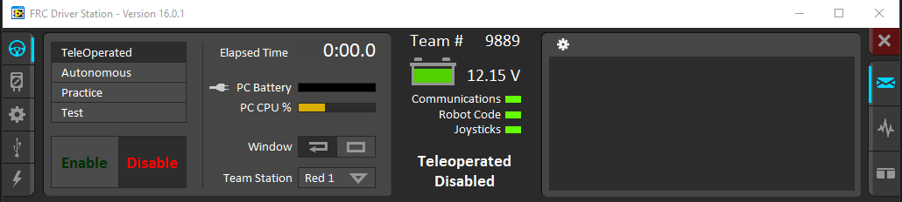

# RoboRIO-Tunnel
Connect your RoboRIO over USB (or any interface) using the official Driver Station.

## Download
Download the .jar file [here](https://github.com/JacisNonsense/RoboRIO-Tunnel/releases)

## Running
Double click the `roborio-tunnel.jar` file or run `java -jar roborio-tunnel.jar` to launch the program.  

An icon will appear in your system tray (it's a small RoboRIO) that you can right click and click 'Exit' to quit the program if you so desire.  
_(If running from the command line, CTRL+C or SIGINT works just fine)._

On your Driver Station, change the Team Number to `9889` and plug your RoboRIO into USB. That's it.

## Custom Team Number / RoboRIO IP
If you want to connect to a RoboRIO with a known IP Address, but on a network where mDNS does not work, you can launch the program with the following arguments.   
`java -jar roborio-tunnel.jar ip <desired ip address> team <team number>`

